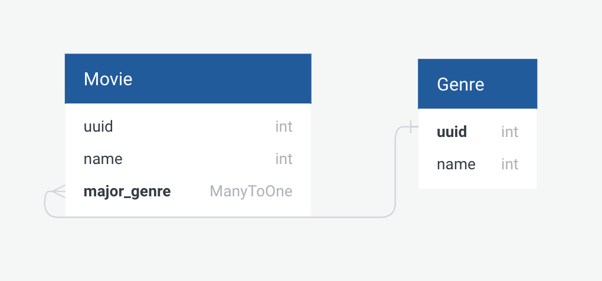

# Project-03-repo-si507

This is a web app where you can store your own movie database with genre. It allows you to create movie and genre as well as view them.

# Getting Started

To install, please clone this project first, and make sure you have Python 3.6+ and virtual environment setup and activated. Then: 

1. `cd` to the project root.
1. `pip install -r requirements.txt`
1. `python server.py` to start the web app. You can then open your browser and navigate to [http://127.0.0.1:5000/](http://127.0.0.1:5000/) to view the app.

## 1. Database Schema Design

Our schema is relatively simple, but the web app is not...!

## 2. Routing

This section walks you through the routes we have. You should not need to maually type them in your browser, however. The web app includes all the pages you are able to visit by hyperlinks, so you only have to click on them in order to enjoy every functionality and page.

### Page Routes

We have three pages in total, one is the homepage, and the others are pages that let you fill in a form to create new movie and genre.

#### `GET /`: Index

This is the home page where you can access the two other pages that allow you to create movie and genre. You will see two links bringing you there. Also, this page list all movies and genres you have so far. It's a good place to check out after you create a new movie or genre.

#### `GET /movie/`: Create movie form

It's a simple page allows you to fill in title and genre, in order to create new movie. After clicking submit, if the creation succeed, you'll be brought to the homepage.

#### `GET /genre/`: Create genre form

A simple page containing a form for you to create new genre. After clicking submit, if the creation succeed, you'll be brought to the homepage.

### API Routes

API routes all return JSON objects. They don't serve html page but data.

- `GET /movies/<string:id>/`: this endpoint returns a movie by the id specified.

- `POST /movie/`: creates a new movie, with the data specified in request payload (body).

- `GET /genres/`: returns all genres data.

- `GET /genres/<string:id>/`: returns data of a genre by id.

- `POST /genre/`: create a new genre.

## Additional Consideration

- Use UUID for object id to enhance security and avoid object sniffing.
- Organize project into several parts for better maintainability and scalability.
    - `server.py`: global configuration of the flask app, including database initialization.
    - `models.py`: includes all the data models.
    - `controllers.py`: includes all routes and their controllers that determine how the server respond to the request.
    - `templates/**`: these are Jinja templates rendered by controllers.
    - `static/**`: front end JavaScript code libraries.
- Frontend-focused web app: to approach the single page application trend, most part of our web app uses the server's API to exchange data. All of our form page uses Ajax-style API call to carry out object creation.

# Reference

- [Project Description Google Doc](https://docs.google.com/document/d/1o22c0j575S2yZtlp9iiF4EdDrDmkc0qytxxS0yxczJg/edit).
- [Databse schema design web app](https://app.quickdatabasediagrams.com/#/d/oo35Ob)
- [SQLAlchemy Query Object API](https://docs.sqlalchemy.org/en/latest/orm/query.html)